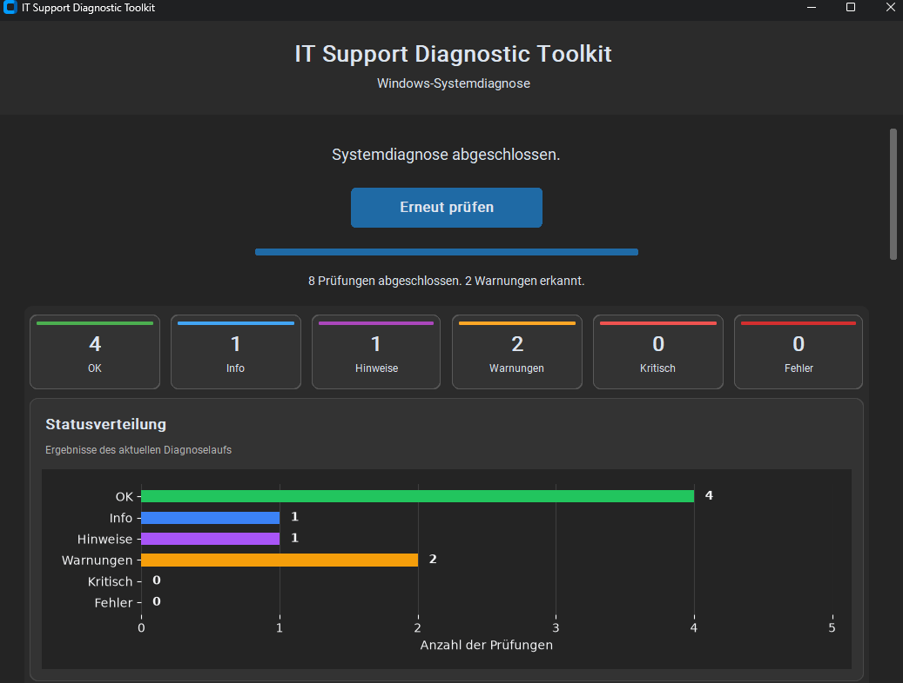
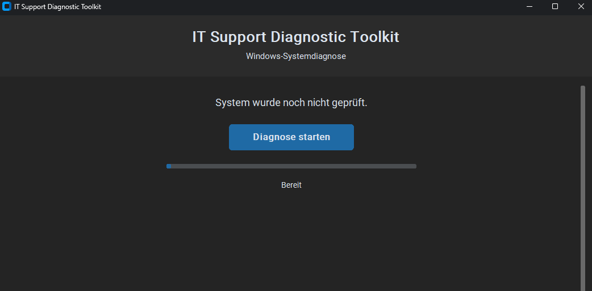
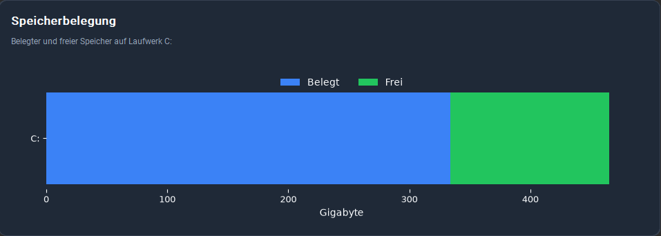

# IT Support Diagnostic Toolkit

Eine grafische Windows-Diagnoseanwendung zur automatisierten Prüfung typischer Support-, Netzwerk- und Sicherheitsbereiche.




## Überblick

Das IT Support Diagnostic Toolkit bündelt mehrere Windows-Prüfungen in einer grafischen Anwendung. Die Ergebnisse werden automatisch bewertet und in einer übersichtlichen Oberfläche dargestellt.

Die Anwendung zeigt den aktuellen Systemzustand über Statuskarten, Diagramme und filterbare Ergebnisbereiche. Zusätzlich erstellt sie einen strukturierten Markdown-Bericht und speichert Diagnoseläufe für spätere Vergleiche.

Das Projekt wurde als praxisnahes Portfolio-Projekt für IT-Support, Systemadministration und Cybersecurity-Grundlagen entwickelt.

## Hauptfunktionen

- grafische Windows-Desktopanwendung mit CustomTkinter
- automatisierte Prüfung mehrerer System- und Sicherheitsbereiche
- kompakte Statusübersicht mit OK, Info, Hinweis, Warnung, Kritisch und Fehler
- anklickbare Statuskarten zur Filterung der Diagnoseergebnisse
- Diagramm zur aktuellen Statusverteilung
- gestapelte Darstellung der Speicherbelegung
- Diagnoseverlauf auf Basis gespeicherter Scans
- strukturierte Detailansicht für jeden Diagnosebereich
- automatischer Markdown-Supportbericht
- Bericht öffnen und an einem eigenen Zielort speichern
- Erstellung einer eigenständigen Windows-EXE mit PyInstaller
- versteckte Ausführung externer Windows- und PowerShell-Prozesse

## Screenshots

### Startansicht

Die Anwendung zeigt beim Start nur den zentralen Diagnosebereich. Ergebnisse und Diagramme erscheinen erst nach einer abgeschlossenen Prüfung.



### Dashboard und Statusverteilung

Nach der Diagnose werden die Gesamtbewertung, die Statuskarten und die aktuelle Verteilung der Ergebnisse angezeigt.


### Speicherbelegung

Der belegte und freie Speicherplatz von Laufwerk C: wird als gestapelte Säule dargestellt.



### Berichtsfunktionen

Diagnoseberichte können direkt geöffnet oder an einem frei gewählten Zielort gespeichert werden.


## Diagnosebereiche

| Bereich | Beschreibung |
|---|---|
| Systeminformationen | Computername, Benutzername, Betriebssystem, Architektur, CPU-Kerne und weitere Systemdaten |
| Netzwerkprüfung | Aktive IP-Adresse, Standardgateway, Ping-Tests und DNS-Auflösung |
| Speicherplatzprüfung | Gesamt-, belegter und freier Speicherplatz mit automatischer Bewertung |
| Firewallprüfung | Status der Windows-Firewall für Domänen-, private und öffentliche Profile |
| Defenderprüfung | Echtzeitschutz, Antivirus-Status, Signaturinformationen und Schutzstatus |
| Windows Update | Update-Dienst, letztes installiertes Update und Bewertung des Update-Status |
| Offene Ports | Lokale TCP-Listening-Ports, zugehörige Prozesse und auffällige Standardports |
| BitLocker | Verschlüsselungsstatus, Schutzstatus und Verschlüsselungsgrad von Laufwerk C: |
| Markdown-Bericht | Automatische Erstellung eines strukturierten Supportberichts |
| Gesamtbewertung | Zusammenfassung aller Ergebnisse nach Statusstufe |
| Scan-Historie | Speicherung vergangener Diagnosen für spätere Verlaufsdiagramme |

## Statusbewertung

| Status | Bedeutung |
|---|---|
| OK | Prüfung ohne Auffälligkeit abgeschlossen |
| Info | Informative Systemangabe ohne Handlungsbedarf |
| Hinweis | Auffälligkeit oder Information, die geprüft werden sollte |
| Warnung | Möglicher Handlungsbedarf |
| Kritisch | Dringender Handlungsbedarf |
| Fehler | Prüfung konnte nicht korrekt ausgeführt werden |

Die Statuskarten im Dashboard sind interaktiv. Ein Klick auf eine Karte zeigt nur die dazugehörigen Diagnoseergebnisse an. Ein erneuter Klick entfernt den Filter.

## Voraussetzungen

- Windows 10 oder Windows 11
- Python 3.12 oder neuer
- PowerShell
- Git

## Installation

```powershell
git clone https://github.com/n-somas/it-support-diagnostic-toolkit.git
cd it-support-diagnostic-toolkit
python -m venv .venv
.venv\Scripts\activate
python -m pip install -r requirements.txt
```

## Anwendung starten

```powershell
python -m src.gui.app
```

## Windows-EXE erstellen

```powershell
.\build_exe.ps1
```

Die fertige Datei befindet sich anschließend unter:

```text
dist\IT-Support-Diagnostic-Toolkit.exe
```

## Berichte

Nach einer abgeschlossenen Diagnose wird automatisch ein Markdown-Bericht erzeugt:

```text
reports\support_report.md
```

Der Bericht kann in der Anwendung geöffnet oder unter einem eigenen Dateinamen gespeichert werden.

## Scan-Historie

Diagnoseläufe werden lokal als JSON-Dateien gespeichert:

```text
data\scans
```

Diese Daten werden für den Diagnoseverlauf verwendet.

## Projektstruktur

```text
it-support-diagnostic-toolkit/
├── src/
│   ├── checks/
│   ├── gui/
│   ├── report/
│   ├── services/
│   ├── utils/
│   └── diagnostic_runner.py
├── docs/
│   └── images/
├── data/
│   └── scans/
├── reports/
├── build_exe.ps1
├── requirements.txt
└── README.md
```

## Datenschutz

Die Anwendung liest lokale System-, Netzwerk- und Sicherheitsinformationen aus. Berichte, Screenshots und Scan-Dateien sollten vor einer Veröffentlichung geprüft und bei Bedarf anonymisiert werden.

Das Tool überträgt keine Diagnosedaten automatisch an externe Dienste.

## Technische Schwerpunkte

- Python
- CustomTkinter
- Matplotlib
- PowerShell-Aufrufe aus Python
- Windows-Systemdiagnose
- Hintergrund-Threads
- JSON-Datenhaltung
- Markdown-Berichte
- PyInstaller
- Git und GitHub

## Roadmap

- Vergleich zweier Diagnoseläufe
- Netzwerk-Latenzdiagramm
- Verlauf der Speicherbelegung
- Prüfung von Windows-Diensten
- Windows-Ereignisanzeige
- Analyse von Autostartprogrammen
- HTML- und PDF-Berichte
- aktivierbare Diagnosemodule
- Export und Import der Scan-Historie

## Projektstatus

**Funktionsfähige Windows-Desktopanwendung mit mehreren Diagnosemodulen, grafischem Dashboard, interaktiven Ergebnisfiltern, Diagrammen, Scan-Historie, Markdown-Berichten und EXE-Build.**

Das Projekt wird schrittweise weiterentwickelt.
