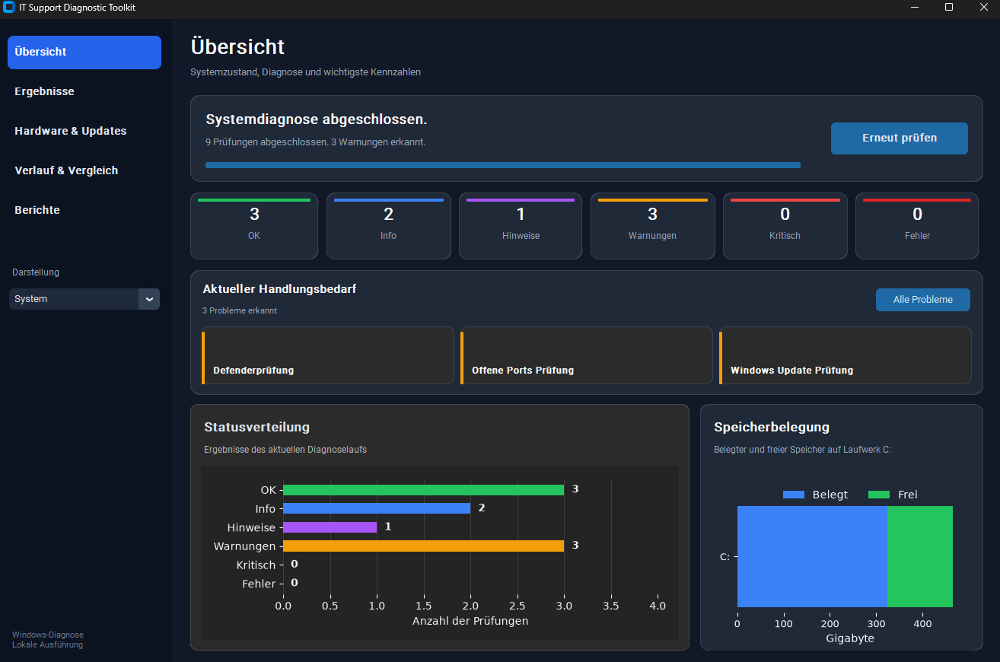
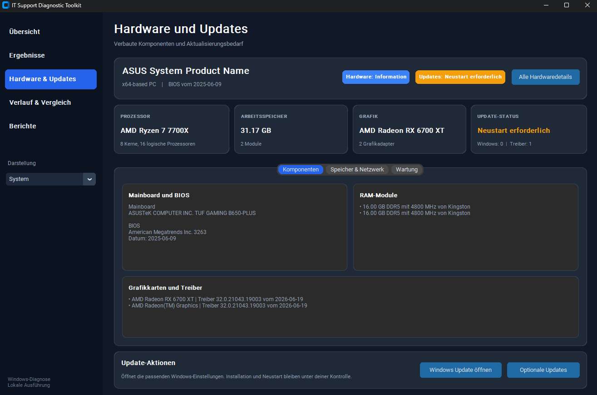
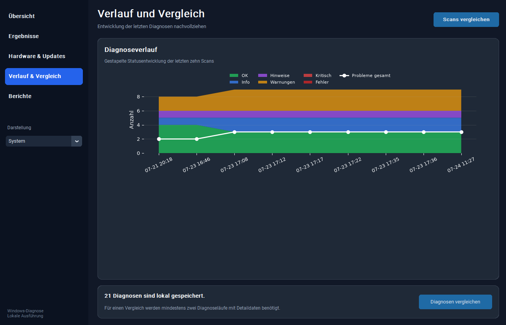
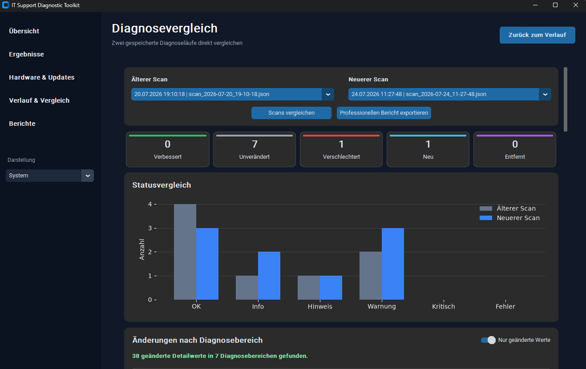

# IT Support Diagnostic Toolkit

Eine lokale Windows-Diagnoseanwendung zur automatisierten Prüfung typischer Support-, Hardware-, Netzwerk- und Sicherheitsbereiche.




## Überblick

Das IT Support Diagnostic Toolkit bündelt mehrere Windows-Prüfungen in einer grafischen Desktopanwendung. Es erfasst System-, Hardware-, Netzwerk- und Sicherheitsinformationen, bewertet die Ergebnisse automatisch und zeigt möglichen Handlungsbedarf übersichtlich an.

Die Anwendung arbeitet lokal auf dem Windows-PC. Diagnosedaten werden nicht automatisch an externe Dienste übertragen. Ergebnisse können gefiltert, im Detail geprüft, als Markdown-Bericht gespeichert und mit früheren Diagnoseläufen verglichen werden.

Das Projekt wurde als praxisnahes Portfolio-Projekt für IT-Support, Systemadministration und Cybersecurity-Grundlagen entwickelt.

## Hauptfunktionen

- moderne Windows-Oberfläche mit fester Seitenleiste
- automatisierte Prüfung von System-, Netzwerk- und Sicherheitsbereichen
- Hardwareinventarisierung für CPU, RAM, GPU, Mainboard, BIOS, Laufwerke und Netzwerkadapter
- Prüfung auf Geräte mit auffälligem Status
- Erkennung verfügbarer Windows- und Treiberupdates
- Erkennung eines ausstehenden Neustarts
- direkter Zugang zu Windows Update und optionalen Updates
- Statusmodell mit OK, Info, Hinweis, Warnung, Kritisch und Fehler
- kompaktes Aktionszentrum für aktuelle Probleme
- vollständig anklickbare Problemkarten
- filterbare Diagnoseergebnisse mit strukturierter Detailansicht
- Diagramme für Statusverteilung und Speicherbelegung
- lokale Scan-Historie
- integrierter Vergleich zweier Diagnoseläufe
- intelligente Bewertung technischer Veränderungen
- professioneller Markdown-Vergleichsbericht
- automatischer Supportbericht für einen einzelnen Diagnoselauf
- eigenständiger Windows-EXE-Build mit PyInstaller
- versteckte Ausführung externer Windows- und PowerShell-Prozesse

## Screenshots

### Startansicht

Vor dem ersten Diagnoselauf zeigt die Anwendung den zentralen Startbereich, die noch leeren Statuskarten und die vorbereiteten Diagrammbereiche.


### Übersicht nach der Diagnose

Nach einer abgeschlossenen Prüfung werden Statuswerte, aktueller Handlungsbedarf, Statusverteilung und Speicherbelegung dargestellt. Die Problemkarten können direkt angeklickt werden.


### Hardware und Updates

Die Hardwareübersicht zeigt Prozessor, Arbeitsspeicher, Grafikkarten, Mainboard, BIOS und den aktuellen Updatebedarf. Windows Update und optionale Treiberupdates können direkt geöffnet werden.



### Diagnoseverlauf

Gespeicherte Diagnoseläufe werden als zeitlicher Verlauf dargestellt. Die Statusentwicklung und die Gesamtzahl erkannter Probleme lassen sich dadurch nachvollziehen.



### Diagnosevergleich

Zwei gespeicherte Diagnoseläufe können innerhalb der Hauptanwendung verglichen werden. Statusänderungen und veränderte Detailwerte werden getrennt dargestellt.



Berichte können als Markdown-Dateien erstellt und exportiert werden. Auf einen Berichtsscreenshot wird bewusst verzichtet, da Diagnoseberichte sensible Systeminformationen enthalten können.

## Diagnosebereiche

| Bereich | Beschreibung |
|---|---|
| Systeminformationen | Computername, Benutzername, Betriebssystem, Architektur und grundlegende Systemdaten |
| Hardwareinventar | Prozessor, Arbeitsspeicher, Grafikkarten, Mainboard, BIOS, Laufwerke und Netzwerkadapter |
| Gerätestatus | Erkennung vorhandener Geräte mit auffälligem oder fehlerhaftem Status |
| Netzwerkprüfung | Aktive IP-Adresse, Standardgateway, Erreichbarkeit und DNS-Auflösung |
| Speicherplatzprüfung | Gesamt-, belegter und freier Speicherplatz mit automatischer Bewertung |
| Firewallprüfung | Status der Windows-Firewall für Domänen-, private und öffentliche Profile |
| Defenderprüfung | Echtzeitschutz, Antivirus-Status, Signaturinformationen und Schutzstatus |
| Windows Update | Verfügbare Windows- und Treiberupdates, letztes installiertes Update und Neustartbedarf |
| Offene Ports | Lokale TCP-Listening-Ports, zugehörige Prozesse und auffällige Standardports |
| BitLocker | Verschlüsselungsstatus, Schutzstatus und Verschlüsselungsgrad von Laufwerk C: |
| Scan-Historie | Lokale Speicherung vergangener Diagnosen |
| Diagnosevergleich | Vergleich von Statuswerten und einzelnen technischen Messwerten |
| Berichte | Erstellung von Support- und Vergleichsberichten im Markdown-Format |

## Statusbewertung

| Status | Bedeutung |
|---|---|
| OK | Prüfung ohne Auffälligkeit abgeschlossen |
| Info | Informative Systemangabe ohne Handlungsbedarf |
| Hinweis | Information oder Auffälligkeit, die geprüft werden sollte |
| Warnung | Möglicher Handlungsbedarf |
| Kritisch | Dringender Handlungsbedarf |
| Fehler | Prüfung konnte nicht korrekt ausgeführt werden |

Die Statuskarten und Problemkarten sind interaktiv. Ein Klick führt direkt zu den gefilterten Ergebnissen oder zur vollständigen Detailansicht.

## Hardware- und Updatefunktionen

Die Hardwareinventarisierung verwendet lokale Windows-Schnittstellen und PowerShell-Abfragen. Dabei werden unter anderem folgende Informationen erfasst:

- Hersteller und Modell des PCs
- Prozessor und Kernanzahl
- installierter Arbeitsspeicher und einzelne RAM-Module
- Grafikkarten und Treiberversionen
- Mainboard sowie BIOS-Version und BIOS-Datum
- physische Laufwerke und gemeldeter Zustand
- aktive Netzwerkadapter
- Geräte mit auffälligem Status

Die Updateprüfung kontrolliert:

- verfügbare Windows-Updates
- verfügbare Treiberupdates
- letztes installiertes Update
- Status des Windows-Update-Dienstes
- erforderlichen Neustart

Die Anwendung installiert keine Updates automatisch. Die Schaltflächen öffnen die passenden Windows-Einstellungen, in denen Installation und Neustart vom Benutzer bestätigt werden.

## Diagnosevergleich

Gespeicherte Diagnoseläufe können direkt innerhalb der Hauptanwendung verglichen werden. Der Vergleich unterscheidet zwischen:

- verbessert
- unverändert
- verschlechtert
- neu hinzugekommen
- nicht mehr vorhanden

Zusätzlich werden einzelne Detailwerte verglichen. Typische Systemschwankungen wie Defender-Signaturupdates, wechselnde DNS-Adressen oder geringe Speicheränderungen werden fachlich eingeordnet, damit normale Veränderungen nicht wie schwerwiegende Probleme wirken.

## Voraussetzungen

- Windows 10 oder Windows 11
- Python 3.12 oder neuer
- PowerShell
- Git

## Installation

```powershell
git clone https://github.com/n-somas/it-support-diagnostic-toolkit.git
cd it-support-diagnostic-toolkit

python -m venv .venv
.venv\Scripts\activate

python -m pip install -r requirements.txt
```

## Anwendung starten

```powershell
python -m src.gui.app
```

## Windows-EXE erstellen

```powershell
.\build_exe.ps1
```

Die fertige Anwendung befindet sich anschließend unter:

```text
dist\IT-Support-Diagnostic-Toolkit.exe
```

## Berichte

Nach einer abgeschlossenen Diagnose wird automatisch ein Markdown-Bericht erzeugt:

```text
reports\support_report.md
```

Zusätzlich kann aus dem integrierten Diagnosevergleich ein professioneller Vergleichsbericht exportiert werden.

## Scan-Historie

Diagnoseläufe werden lokal als JSON-Dateien gespeichert:

```text
data\scans
```

Die gespeicherten Daten werden für den Diagnoseverlauf und den Vergleich zweier Scans verwendet.

## Projektstruktur

```text
it-support-diagnostic-toolkit/
├── src/
│   ├── checks/
│   ├── gui/
│   │   ├── components/
│   │   ├── hardware_page.py
│   │   └── comparison_page.py
│   ├── report/
│   ├── services/
│   ├── utils/
│   └── diagnostic_runner.py
├── docs/
│   └── images/
│       ├── start-screen.png
│       ├── results.png
│       ├── hardware-updates.png
│       ├── history.png
│       └── comparison.png
├── data/
│   └── scans/
├── reports/
├── build_exe.ps1
├── requirements.txt
└── README.md
```

## Datenschutz

Die Anwendung liest lokale System-, Hardware-, Netzwerk- und Sicherheitsinformationen aus. Berichte, Screenshots und Scan-Dateien sollten vor einer Veröffentlichung geprüft und bei Bedarf anonymisiert werden.

Das Tool überträgt keine Diagnosedaten automatisch an externe Dienste.

## Technische Schwerpunkte

- Python
- CustomTkinter
- Matplotlib
- PowerShell-Aufrufe aus Python
- Windows Management Instrumentation und CIM
- Windows-Systemdiagnose
- Hintergrund-Threads
- JSON-Datenhaltung
- Markdown-Berichte
- PyInstaller
- Git und GitHub

## Roadmap

- Prüfung ausgewählter Windows-Dienste
- Auswertung relevanter Windows-Ereignisse
- Analyse von Autostartprogrammen
- Verlauf der Speicherbelegung
- HTML- und PDF-Berichte
- aktivierbare Diagnosemodule
- Export und Import der Scan-Historie
- optionaler Herstellerabgleich für BIOS- und Treiberversionen

## Projektstatus

**Funktionsfähige Windows-Desktopanwendung mit mehreren Diagnosemodulen, Hardwareinventar, grafischem Dashboard, interaktiven Problemkarten, Updateprüfung, Scan-Historie, integriertem Diagnosevergleich, Markdown-Berichten und EXE-Build.**

Das Projekt wird schrittweise weiterentwickelt.
