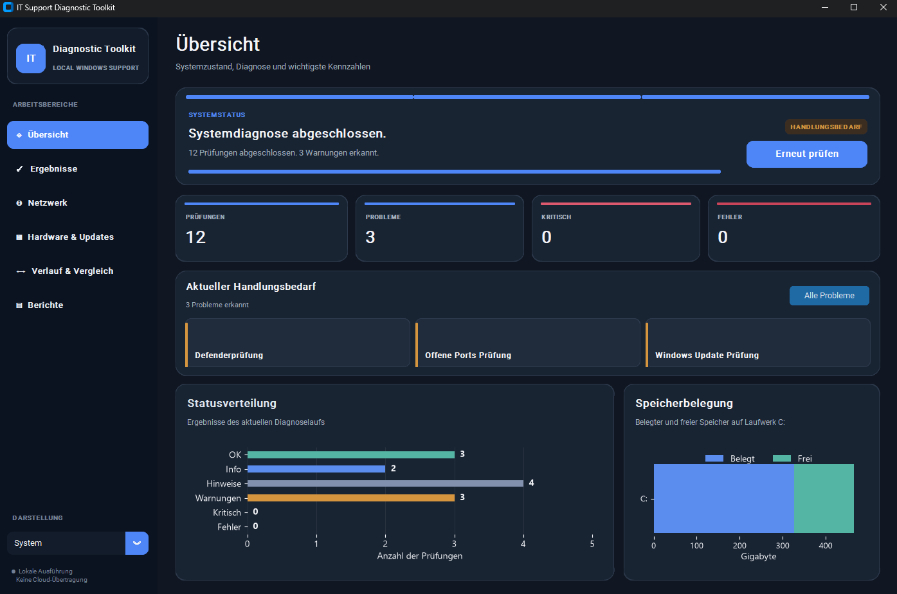
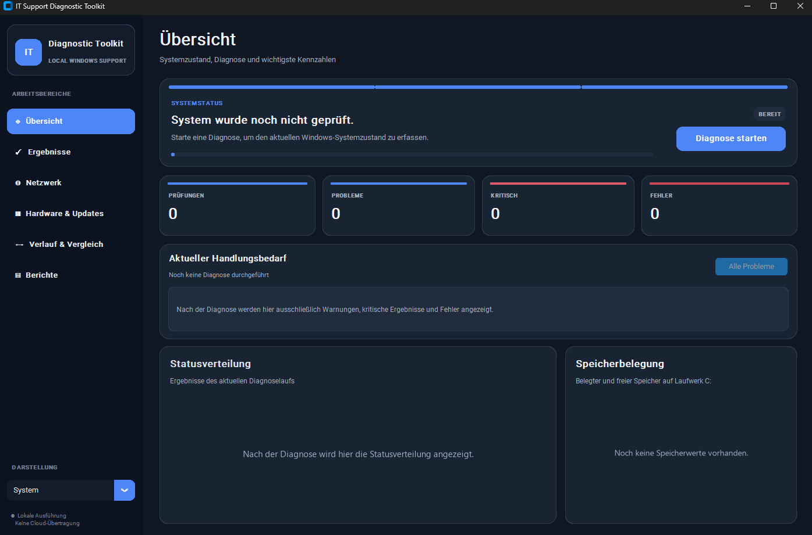
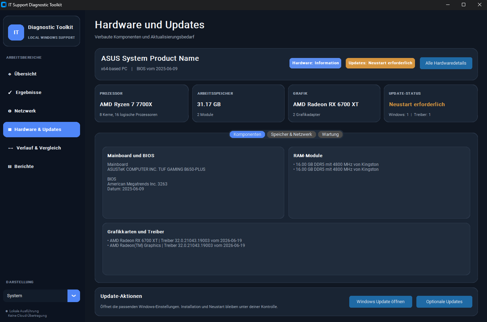
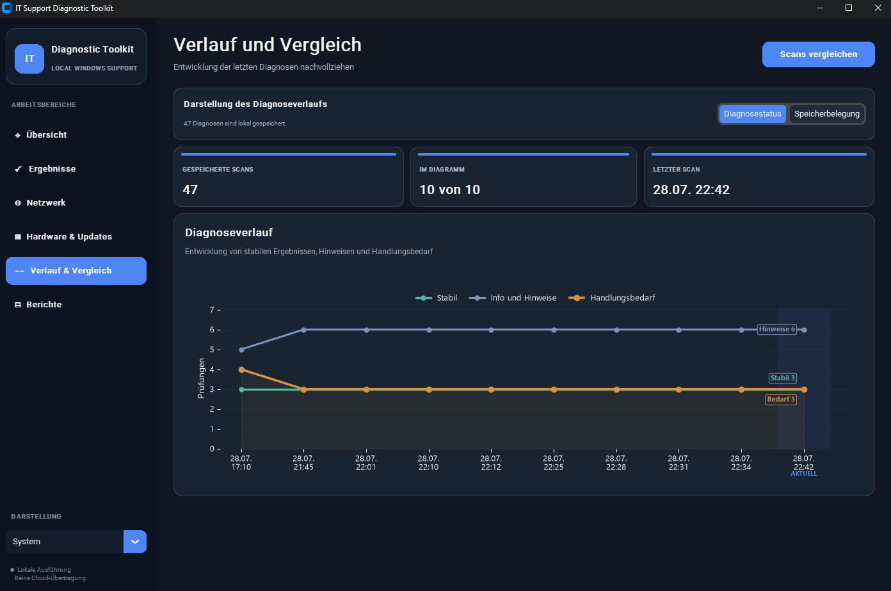
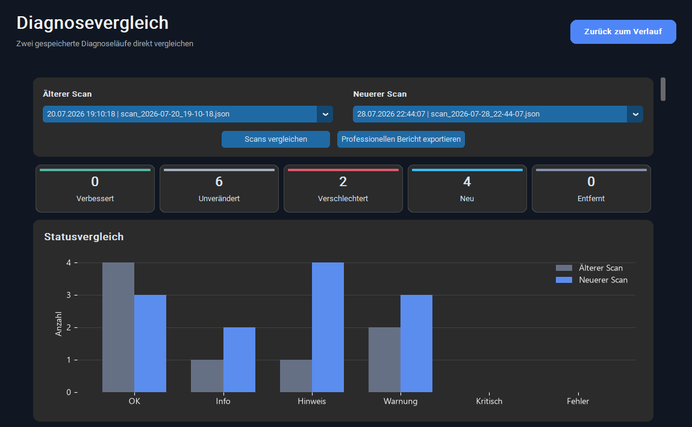

# IT Support Diagnostic Toolkit

A local Windows desktop application for automated IT support diagnostics across system, hardware, network, update, and security-related areas.




## Overview

The **IT Support Diagnostic Toolkit** combines common Windows troubleshooting tasks in a single graphical desktop application.

It collects and evaluates system, hardware, network, Windows Update, service, event-log, startup, firewall, Defender, BitLocker, port, and storage information. Results are automatically classified and presented through an interactive dashboard so that potential support issues can be identified quickly.

All diagnostic processing takes place locally. Diagnostic information is not automatically transmitted to external services.

The project was developed as a practical portfolio application for **IT Support, Windows Administration, System Diagnostics, and Security Operations fundamentals**.

## Key Features

* Automated Windows system diagnostics
* Hardware inventory
* Network configuration and connectivity analysis
* Windows Firewall and Microsoft Defender checks
* Windows Update and driver-update detection
* Pending reboot detection
* Windows service diagnostics
* Privacy-conscious Windows Event Log analysis
* Startup-program inspection
* Local listening-port analysis
* BitLocker status detection
* Device health checks
* Interactive issue cards
* Filterable diagnostic results
* Scan history
* Comparison of two diagnostic runs
* Markdown support reports
* Diagnostic comparison reports
* Status and storage charts
* Standalone Windows executable build with PyInstaller

## Screenshots

### Start Screen



### Diagnostic Dashboard


### Hardware and Updates



### Scan History



### Diagnostic Comparison



## Diagnostic Modules

| Module              | Description                                                                          |
| ------------------- | ------------------------------------------------------------------------------------ |
| System Information  | Hostname, user, operating system, architecture, and basic system information         |
| Hardware Inventory  | CPU, memory, GPU, motherboard, BIOS, drives, and network adapters                    |
| Device Status       | Detects devices reporting abnormal or failed states                                  |
| Network Diagnostics | Active adapters, DHCP, IPv4, gateway, DNS, network profile, packet loss, and latency |
| Storage             | Total, used, and available disk capacity with automatic evaluation                   |
| Windows Firewall    | Domain, private, and public firewall profiles                                        |
| Microsoft Defender  | Antivirus and real-time protection status, signatures, and protection information    |
| Windows Update      | Available Windows and driver updates, last installed update, and reboot requirements |
| Windows Services    | State and startup configuration of selected support and network services             |
| Windows Events      | Critical and error events from System and Application logs                           |
| Startup Programs    | Startup commands, executable paths, signatures, and suspicious startup mechanisms    |
| Open Ports          | Local TCP listening ports and associated processes                                   |
| BitLocker           | Encryption and protection state of the system drive                                  |
| Scan History        | Local storage of previous diagnostic runs                                            |
| Scan Comparison     | Comparison of status values and technical measurements                               |
| Reports             | Markdown support and comparison reports                                              |

## Status Model

Diagnostic checks are classified into six states:

| Status   | Meaning                                               |
| -------- | ----------------------------------------------------- |
| OK       | Check completed without detected issues               |
| Info     | Informational system data                             |
| Notice   | Information or anomaly that should be reviewed        |
| Warning  | Potential action required                             |
| Critical | Urgent action required                                |
| Error    | The diagnostic check could not be completed correctly |

Interactive status and issue cards link directly to the corresponding diagnostic results.

## Windows Event Analysis

The toolkit evaluates critical and error events from the Windows `System` and `Application` logs within the previous 24 hours.

Repeated events are grouped by source and event ID. The evaluation highlights categories such as:

* unexpected shutdowns
* bugchecks
* disk-related errors
* hardware errors
* application crashes
* service failures

For privacy reasons, full event messages are not stored in diagnostic history. Only metadata such as log name, source, event ID, severity, timestamp, and occurrence count is retained.

## Hardware and Update Diagnostics

Hardware information is collected through local Windows interfaces and PowerShell/CIM queries.

The inventory includes:

* system manufacturer and model
* processor and core information
* installed memory and RAM modules
* GPU and driver information
* motherboard
* BIOS version and date
* physical drives and reported state
* active network adapters
* devices with abnormal status

The update module checks for:

* available Windows updates
* available driver updates
* the most recently installed update
* Windows Update service status
* pending reboot state

The application does **not** install updates automatically. It opens the appropriate Windows settings page so that installation remains under user control.

## Diagnostic History and Comparison

Diagnostic runs can be stored locally and compared inside the application.

Changes are categorized as:

* improved
* unchanged
* degraded
* newly detected
* no longer present

Individual technical values can also be compared. Expected changes such as Defender signature updates, changing DNS addresses, or minor storage fluctuations are treated separately to avoid presenting normal system changes as major incidents.

## Architecture

```text
Windows System
      |
      v
Diagnostic Modules
      |
      v
Diagnostic Runner
      |
      +--> Evaluation and Status Logic
      |
      +--> Scan History
      |
      +--> Report Generation
      |
      v
CustomTkinter Desktop UI
      |
      +--> Dashboard
      +--> Hardware View
      +--> History
      +--> Comparison
```

PowerShell and Windows-native interfaces are used where Python alone does not expose the required system information.

## Tech Stack

* Python 3.12
* CustomTkinter
* Matplotlib
* PowerShell
* Windows CIM / WMI
* JSON
* Markdown
* PyInstaller
* Git and GitHub

## Requirements

* Windows 10 or Windows 11
* Python 3.12 or newer
* PowerShell
* Git

## Installation

```powershell
git clone https://github.com/n-somas/it-support-diagnostic-toolkit.git
cd it-support-diagnostic-toolkit

python -m venv .venv
.venv\Scripts\activate

python -m pip install -r requirements.txt
```

## Run the Application

```powershell
python -m src.gui.app
```

## Build the Windows Executable

```powershell
.\build_exe.ps1
```

The executable is created under:

```text
dist\IT-Support-Diagnostic-Toolkit.exe
```

## Reports

After a diagnostic run, a Markdown support report is generated:

```text
reports\support_report.md
```

A separate comparison report can also be exported from the integrated diagnostic comparison view.

## Local Scan History

Previous diagnostic runs are stored as JSON files under:

```text
data\scans
```

These files are used for historical charts and scan comparisons.

## Privacy

The application reads local system, hardware, network, and security information.

Reports, screenshots, and diagnostic files may contain system-specific information and should therefore be reviewed and anonymized before publication or sharing.

The toolkit does not automatically transmit diagnostic data to external services.

## Project Structure

```text
it-support-diagnostic-toolkit/
├── src/
│   ├── checks/
│   ├── gui/
│   │   ├── components/
│   │   ├── hardware_page.py
│   │   └── comparison_page.py
│   ├── report/
│   ├── services/
│   ├── utils/
│   └── diagnostic_runner.py
├── docs/
│   └── images/
├── data/
│   └── scans/
├── reports/
├── build_exe.ps1
├── requirements.txt
└── README.md
```

## Roadmap

* HTML and PDF reports
* Optional diagnostic modules
* Scan-history export and import
* Optional manufacturer lookups for BIOS and driver versions

## Project Status

**Functional Windows desktop application with multiple diagnostic modules, hardware inventory, update detection, interactive dashboards, scan history, diagnostic comparison, Markdown reports, and standalone EXE packaging.**

The project is under active development.
